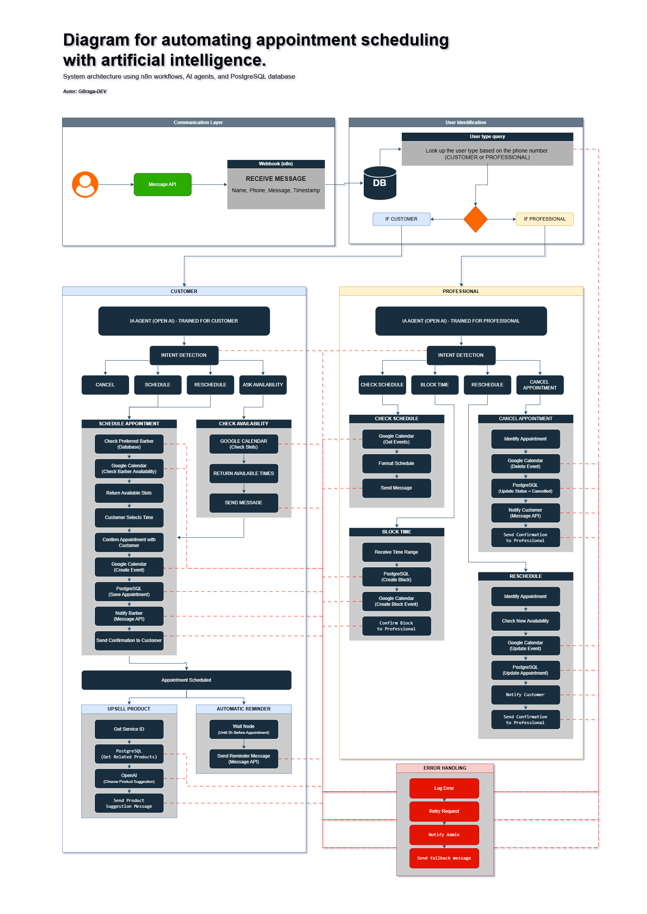

# AI Appointment Scheduling System

An intelligent appointment scheduling system that automates interactions between customers and professionals using artificial intelligence, workflow automation, and calendar integration.

This project demonstrates how conversational AI can be used to manage appointment workflows such as scheduling, rescheduling, cancellations, availability checks, and reminders.

---

# System Architecture

The system is structured in multiple layers to ensure modularity and scalability:

1. Communication Layer
2. User Identification
3. AI Intent Detection
4. Customer Workflow
5. Professional Workflow
6. Error Handling

The architecture separates **customer interactions** from **professional management actions**, allowing the system to scale for real service businesses such as barbershops, clinics, or consulting services.

---

# Architecture Diagram

---

# Tech Stack

### Automation & Orchestration

* n8n workflow automation

### Artificial Intelligence

* OpenAI API for intent detection and conversational responses

### Database

* PostgreSQL

### External Integrations

* Google Calendar for appointment management
* Messaging API (WhatsApp / SMS)

### Infrastructure Concepts

* Webhooks for message ingestion
* AI agents for conversation processing
* Database persistence for appointments and services

---

# Core Features

### Customer Features

* Schedule appointments
* Reschedule appointments
* Cancel appointments
* Check service availability
* Receive confirmation messages
* Receive automatic reminders
* Receive service recommendations (AI upsell)

---

### Professional Features

* View schedule
* Block unavailable time slots
* Reschedule customer appointments
* Cancel appointments
* Receive confirmation updates

---

# Workflow Overview

### Customer Flow

1. Customer sends a message
2. Webhook receives the request
3. System identifies the user type
4. AI detects the message intent
5. Workflow executes the correct action
6. Calendar and database are updated
7. Confirmation message is sent

---

### Professional Flow

Professionals can manage their schedule through:

* viewing their schedule
* blocking unavailable times
* rescheduling appointments
* cancelling appointments

All changes are synchronized with the calendar and the database.

---

# Error Handling

The system includes a centralized error handling strategy:

* Log errors
* Retry failed requests
* Notify administrator
* Send fallback message to the user

This ensures system stability even when external services fail.

---

# Future Improvements

Possible improvements for future versions:

* Input validation layer
* No-show detection
* Payment integration
* Analytics dashboard
* Multi-business support
* AI-powered schedule optimization

---

# Project Structure

ai/
customer-system-prompt.txt
professional-system-prompt.txt

database/
database-schema.sql

docs/
project-overview.md
workflow-diagram.png

workflows/
n8n-workflow-example.json

LICENSE
README.md
README-PT.md

---

# Use Case

This system is designed for service-based businesses such as:

* barbershops
* beauty salons
* clinics
* consultants
* freelancers

It demonstrates how AI and automation can reduce manual scheduling work and improve customer experience.

---

# Author

Developed by GBraga-DEV

---

# License

This project is licensed under the MIT License.
